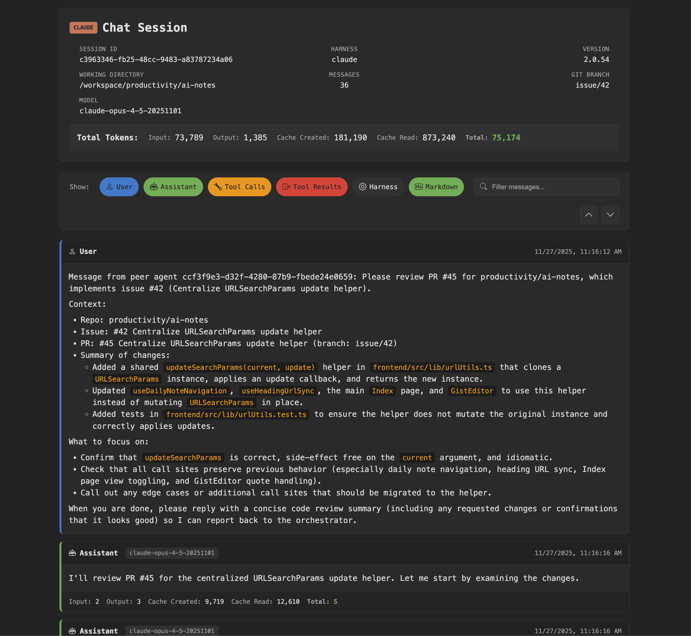
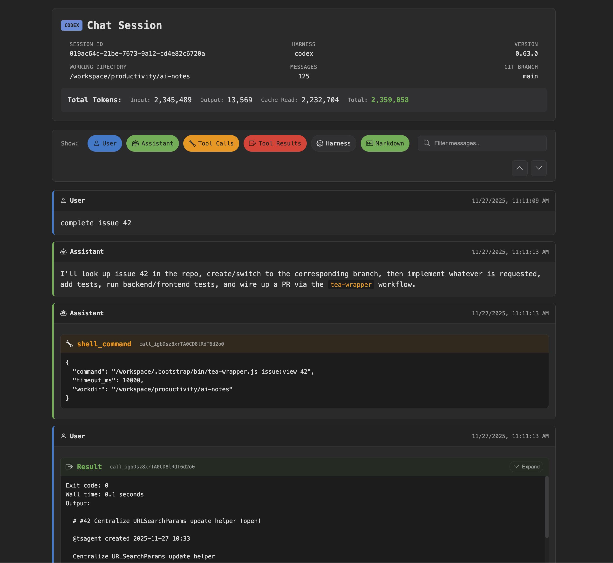

# chat-to-html

Convert AI chat session logs into readable HTML reports.

chat-to-html takes JSONL log files from AI coding assistants and generates standalone HTML pages with syntax highlighting, tool call visualization, token usage statistics, and filtering controls.

## Examples



## Supported Formats

- **Claude Code** - Claude's CLI assistant logs
- **OpenAI Codex** - Codex CLI session logs
- **Google Gemini** - Coming soon

## Features

- **Customizable themes** via CLI color options
- Dark themed, responsive HTML output
- Markdown rendering in messages (headers, lists, code blocks, links)
- Tool call and result visualization with syntax highlighting
- Token usage tracking (input, output, cache)
- Filter toggles to show/hide message types (User, Assistant, Tool Calls, Tool Results, Harness, Thinking)
- Optional reasoning/metadata view for advanced logs (Codex agent reasoning and Claude thinking/todo metadata as harness messages, hidden by default)
- Session metadata display (model, branch, working directory)

## Installation

```bash
# Clone or download the project
cd chat-to-html

# Install dependencies
npm install

# Build
npm run build
```

## Usage

```bash
# Convert a single file
node dist/index.js session.jsonl

# Convert multiple files
node dist/index.js session1.jsonl session2.jsonl

# Specify output directory
node dist/index.js -o ./reports session.jsonl

# Disable harness message detection (enabled by default)
node dist/index.js --no-identify-harness session.jsonl

# Apply a custom theme
node dist/index.js \
  --bg-page "#1a1b26" \
  --bg-card "#24283b" \
  --text-main "#c0caf5" \
  --accent-user "#7aa2f7" \
  session.jsonl
```

### Options

| Option | Description |
|--------|-------------|
| `-h, --help` | Show help message |
| `-o, --output <dir>` | Output directory (default: same as input file) |
| `--no-identify-harness` | Disable harness message detection (enabled by default) |

### Theme Options

All color options accept hex values (e.g., `"#1a1a2e"`):

| Option | Description |
|--------|-------------|
| `--bg-page` | Page background |
| `--bg-card` | Message cards, header |
| `--bg-accent` | Token summary, filter buttons |
| `--text-main` | Main text |
| `--text-muted` | Timestamps, labels |
| `--border` | Card borders, dividers |
| `--accent-user` | User message border, links |
| `--accent-assistant` | Assistant message border |
| `--accent-tool` | Tool call headers, inline code |
| `--accent-result` | Tool result headers |

### Font Options

| Option | Description |
|--------|-------------|
| `--font-ui` | UI font family (prepended to system fallbacks) |
| `--font-code` | Code font family (prepended to monospace fallbacks) |

Output HTML files are created alongside the input files (or in the specified output directory) with the same name but `.html` extension.

## Example Files

The `examples/` directory contains sample session files you can use to try out the tool:

```bash
# Convert the included example files
node dist/index.js examples/claude.jsonl examples/codex.jsonl
```

- `examples/claude.jsonl` - Claude Code CLI session
- `examples/codex.jsonl` - OpenAI Codex CLI session

## Example Output

The HTML includes:

- **Header** - Session ID, model, version, working directory, git branch, message count
- **Token Summary** - Total input/output tokens with cache statistics
- **Filter Bar** - Toggle visibility of users, assistants, tool calls, tool results, harness messages, and Thinking messages (Codex reasoning / Claude thinking metadata)
- **Messages** - Chronological chat history with timestamps and per-message token counts

### Harness & Thinking messages

- **Harness** messages represent orchestration or harness-level metadata (e.g., todo updates, tool orchestration logs) and are detected by default.
- **Thinking** messages represent model reasoning snippets (Codex `agent_reasoning` events and Claude thinking metadata when available).
- Both are treated as optional annotations: they are hidden by default in the HTML and can be revealed via the Harness/Thinking filter pills, or fully suppressed at parse time with `--no-identify-harness`.

## License

MIT
